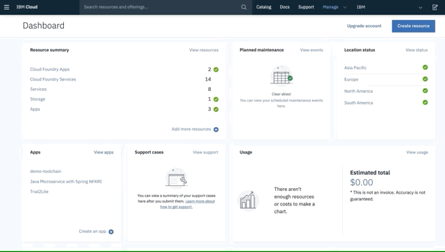
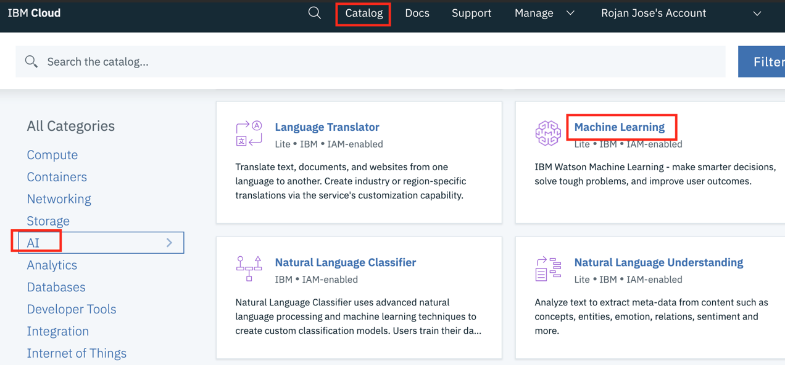
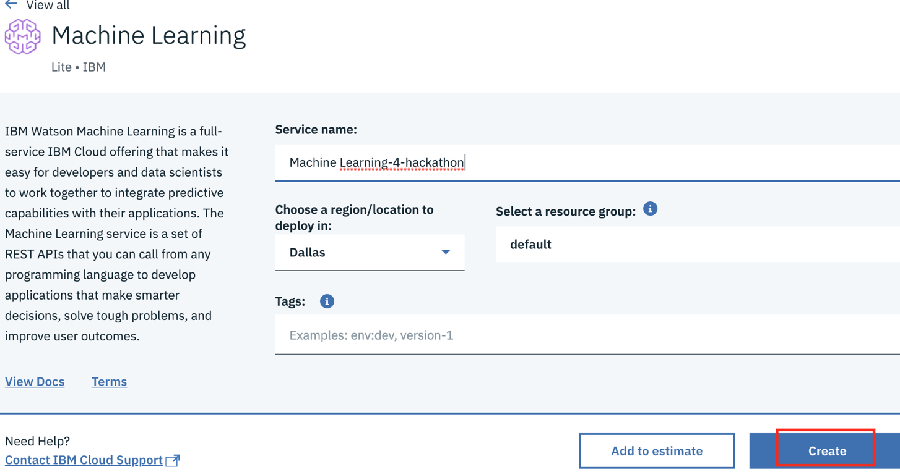

# First Data Global Hackathon 
## May 18th - 19th

Welcome to the IBM page for the First Data hackathon!

Click [here](attach/IBM-FirstDataHackathonPresentation.pdf) to view  enablement presentation. 

## Onboarding IBM Cloud

Onboarding and provisioning services for Hackaton on IBM cloud is a simple three step process. 1. Create IBM Cloud account 2. Request and apply a promo code 3. Provision  services.

The promo code upgrades the free IBM Lite Account to a trial account. A trial account enables paid services such as Kubernetes, AI etc for a trail period. 

**1. Create IBM Cloud account**

Use your existing IBM id or create a new id. 
[IBM Cloud](https://ibm.biz/Bdzi6C)

**2. Request and apply a promo code**

**Goto:** [https://developer.ibm.com/callforcode/featurecode](https://developer.ibm.com/callforcode/featurecode)

> Use Confirmation Code: `CFCday19`

After requesting and saving the promo code from above,  select `Manage` from the top menu bar, then `Account`.  Within the account page select the `Account Settings` option and scroll down to enter your feature code retrieved above.

**3. Provision services**

Select the service from the catalog:

Click on create to provision:

**While listing**
This link provides you instructions to whitelist by region.
https://cloud.ibm.com/registration/whitelist#

----

## Contacts

- [Rojan Jose](mailto:rojan@us.ibm.com) - IBM Developer Advocate - 919 609 0428
- [Jason Demby](mailto:jason.demby@ibm.com) - Global Cloud CTO, First Data - 917 273 2762
- [Dale Smith](mailto:dgsmith@us.ibm.com) - Global Cloud CTO, First Data - 402 681 7995

